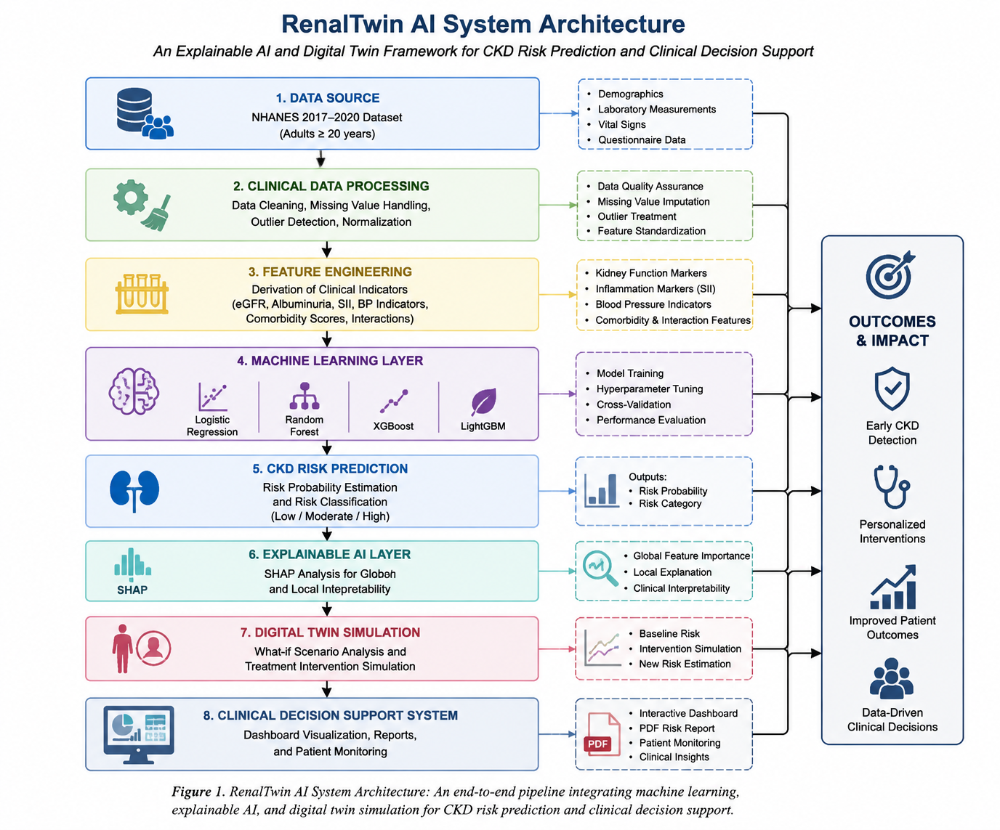
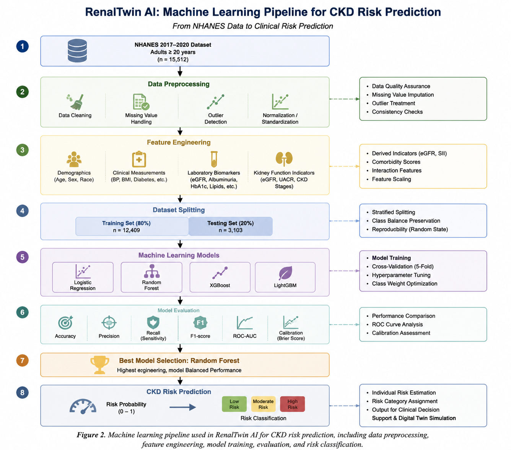
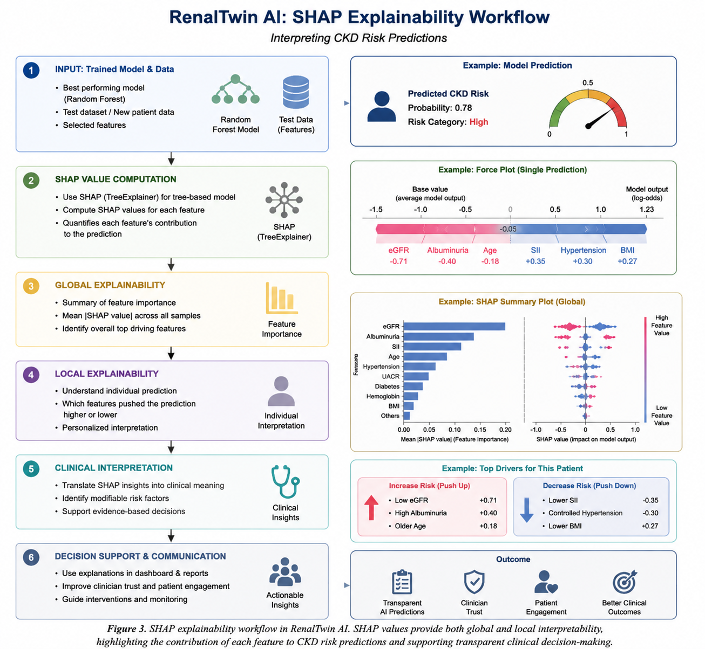
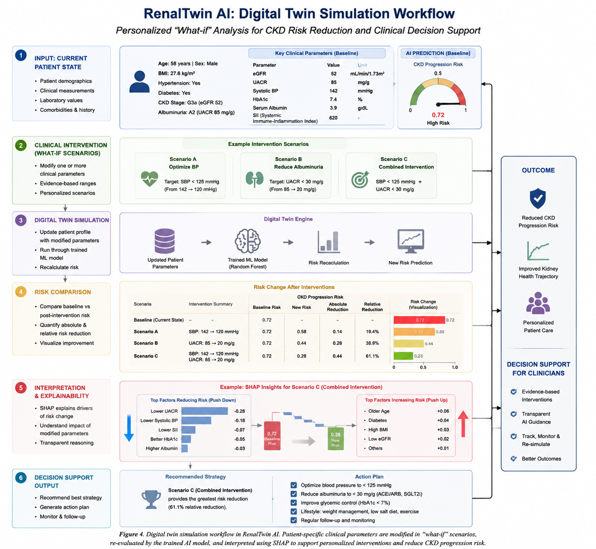
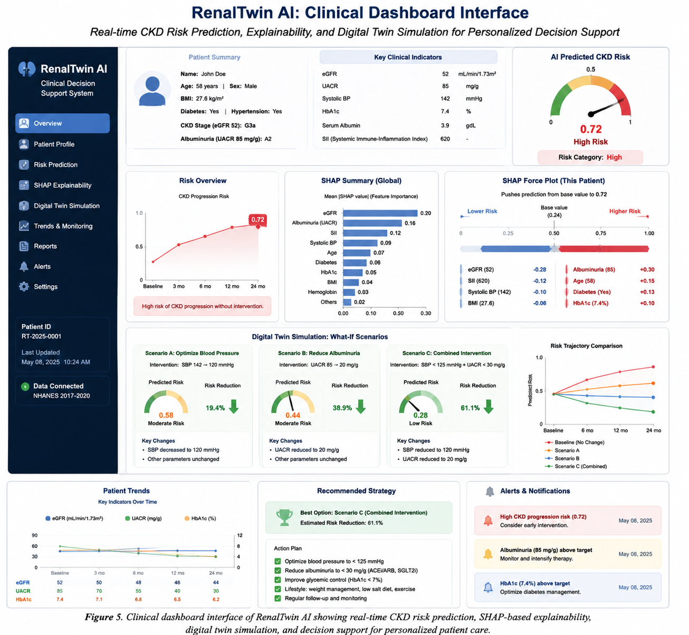

# 🩺 RenalTwin AI V2

# Explainable AI-Driven Digital Twin Framework for Personalized Chronic Kidney Disease Risk Prediction, Simulation, and Clinical Decision Support


---

# Overview

RenalTwin AI V2 is an Explainable Artificial Intelligence (XAI)-based Digital Twin Clinical Decision Support System developed for personalized Chronic Kidney Disease (CKD) risk prediction, monitoring, and intervention simulation.

The framework integrates:

- Machine learning-based CKD risk prediction
- Explainable AI using SHAP
- Patient-specific digital twin simulation
- Clinical decision support
- Automated clinical reporting

Unlike conventional CKD prediction models that only provide risk probabilities, RenalTwin AI explains the reasons behind predictions and enables simulation of potential clinical interventions.

---

# System Architecture

The RenalTwin AI framework consists of five integrated layers:

## 1. Clinical Data Acquisition Layer

Sources:

- NHANES 2017–2020 dataset
- Demographic information
- Anthropometric measurements
- Blood pressure measurements
- Laboratory biomarkers
- Kidney function indicators

↓

## 2. Data Processing and Feature Engineering Layer

Functions:

- Data cleaning
- Missing value handling
- Clinical variable transformation
- Feature selection
- CKD label generation

Generated features:

- eGFR
- Albuminuria
- SII
- Blood pressure indicators
- Metabolic indicators

↓

## 3. Artificial Intelligence Prediction Layer

Multiple machine learning models are implemented:

### Model A
Early CKD Screening

Input:

- Demographics
- BMI
- Blood pressure
- CBC biomarkers

Purpose:

Population-level early risk identification


### Model B
Clinical Screening

Additional inputs:

- Serum creatinine
- Serum albumin

Purpose:

Clinical CKD risk assessment


### Model C
Diagnostic Support

Additional inputs:

- eGFR
- UACR

Purpose:

Advanced kidney-specific assessment


Algorithms:

- Logistic Regression
- Random Forest
- XGBoost
- LightGBM


↓

## 4. Explainable AI Layer

SHAP-based explainability provides:

- Global feature importance
- Individual patient explanation
- Risk factor contribution analysis


Example interpretation:


Patient CKD Risk = 82%

Major contributors:

↑ Serum Creatinine
↑ Age
↑ Blood Pressure

Protective factors:

↓ Normal BMI
↓ Normal biomarkers


↓

## 5. Digital Twin and Clinical Decision Support Layer

The digital twin creates a virtual patient representation.

It enables:

"What-if" clinical simulation:

Examples:

- Improvement in renal function
- Blood pressure modification
- Lifestyle changes
- Combined intervention scenarios


Simulation process:


Current Patient State

    ↓

Modify Clinical Parameters

    ↓

AI Prediction Engine

    ↓

Updated CKD Risk

    ↓

Clinical Recommendation


The final output includes:

- Risk prediction
- Explainable factors
- Intervention simulation
- PDF clinical report

---

# Key Features

## 🧠 Model A: Early CKD Screening

Designed for early population screening.

Features:

- Age
- Sex
- Race
- BMI
- Waist circumference
- Blood pressure
- CBC biomarkers

No kidney biomarkers required.

---

## 🩺 Model B: Clinical Screening

Designed for clinical risk assessment.

Additional features:

- Serum creatinine
- Serum albumin

Provides improved prediction capability.

---

## 🔬 Model C: Diagnostic Support

Designed for advanced kidney assessment.

Additional features:

- Estimated Glomerular Filtration Rate (eGFR)
- Urinary Albumin-to-Creatinine Ratio (UACR)

---

# Artificial Intelligence Models

Implemented algorithms:

- Logistic Regression
- Random Forest
- XGBoost
- LightGBM

Deployed prediction engine:

**Random Forest**

---

# Explainable AI Module

RenalTwin AI integrates SHAP (SHapley Additive exPlanations).

Capabilities:

- Global model interpretation
- Individual patient explanation
- Feature contribution analysis

Major predictive factors identified:

- Serum creatinine
- Age
- Blood pressure
- BMI
- Hemoglobin
- Metabolic indicators

---

# Digital Twin Module

The digital twin represents an individual patient's predicted clinical state.

It allows simulation of possible changes before clinical decision-making.

Example:

Baseline:


CKD Risk = 89.7%


Simulation:


Improve renal function

↓

New CKD Risk = 56.7%


The system evaluates how specific clinical modifications influence predicted risk.

---

# Evaluation Framework

Model performance is evaluated using:

- Accuracy
- Precision
- Recall
- F1-score
- ROC-AUC
- ROC Curve
- Precision-Recall Curve
- Calibration Curve
- Threshold Optimization
- 5-Fold Cross Validation

---

# Dataset

Dataset:
---

# System Visualization

## Figure 1: RenalTwin AI System Architecture




## Figure 2: Machine Learning Pipeline




## Figure 3: SHAP Explainability Workflow




## Figure 4: Digital Twin Simulation Workflow




## Figure 5: Clinical Dashboard Interface



---
## National Health and Nutrition Examination Survey (NHANES) 2017–2020

Variables include:

### Demographics

- Age
- Sex
- Race

### Clinical Measurements

- BMI
- Waist circumference
- Blood pressure

### Laboratory Biomarkers

- Serum creatinine
- Albumin
- Hemoglobin
- Platelets
- Lymphocytes

### Kidney Indicators

- eGFR
- Albuminuria
- CKD stage

---

# Technologies

## Programming

- Python

## Machine Learning

- Scikit-Learn
- XGBoost
- LightGBM

## Explainability

- SHAP

## Application

- Streamlit

## Visualization

- Plotly

## Reporting

- ReportLab

---

# Installation

Clone repository:

```bash
git clone https://github.com/mridulh404-art/RenalTwin_AI_V2.git
